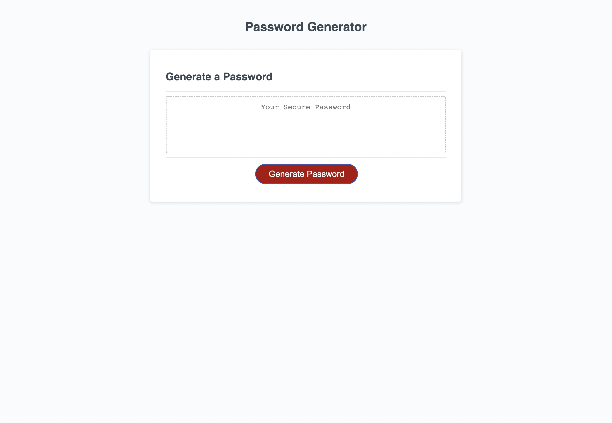

# Random Password Generator

## Coding Boot Camp - challenge 03 

The purpose of this application is to generate a random password between 8 and 128 characters long based on inputs selected by the user. After clicking the 'Generate Password' button the user is asked the desired length of the password (min 8 characters, max 128 characters) and is given the option of including numbers, lower case letters, upper case letters and special characters. Based on the users responses a random combination of the selected characters of the requested length is displayed in the text box and can be selected and copied by the user.

The HTML and CSS files for this challenge were provided along with a screenshot and the required functionality - the JavaScript file needed to be created from scratch to make the application function in the desired way.


Array concatenation, if statements, for loops and event listeners were used in this challenge building on the skills and knowledge learned during class in week 03 of Boot Camp.


```md

```

